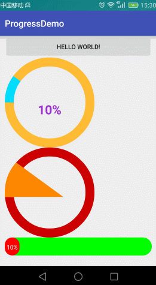

 roundColor 圆环的颜色

 roundProgressColor 进度的颜色

 roundWidth 圆环的宽度

 textColor 文字颜色

 textSize  文字大小

 max 最大值

 textIsDisplayable  是否显示进度文本

 style 样式
 STROKE 空心
 FILL 实心

     <declare-styleable name="RoundProgressBar">
        <attr name="roundColor" format="color"/>
        <attr name="roundProgressColor" format="color"/>
        <attr name="roundWidth" format="dimension"></attr>
        <attr name="textColor" format="color" />
        <attr name="textSize" format="dimension" />
        <attr name="max" format="integer"></attr>
        <attr name="textIsDisplayable" format="boolean"></attr>
        <attr name="style">
            <enum name="STROKE" value="0"></enum>
            <enum name="FILL" value="1"></enum>
        </attr>
    </declare-styleable>